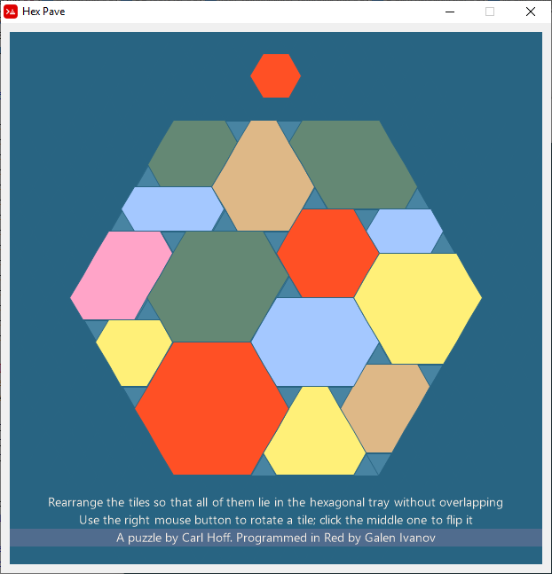
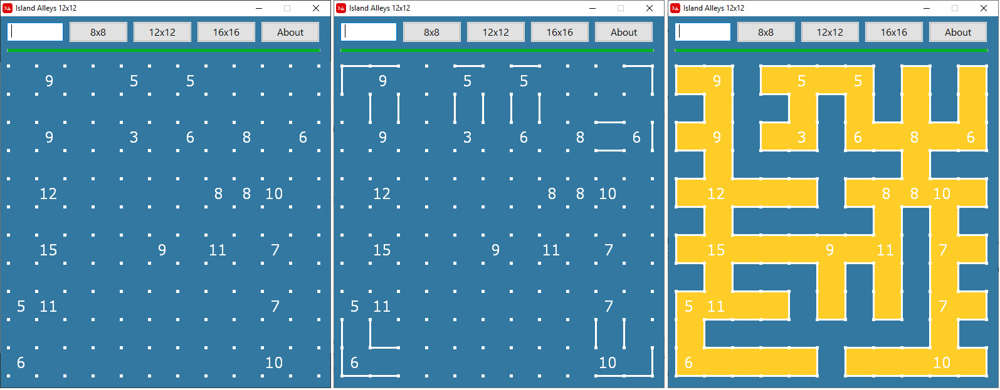
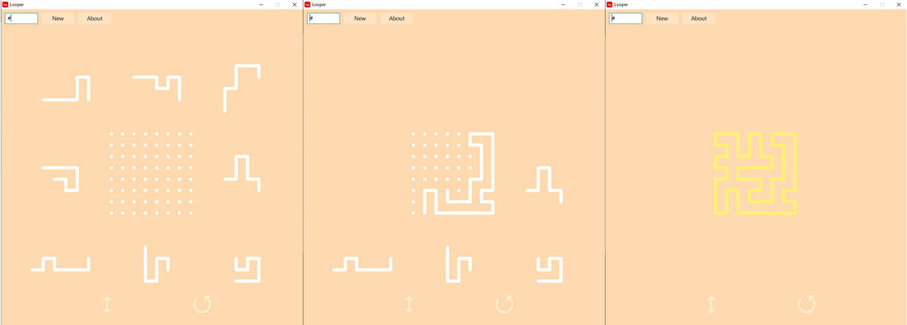
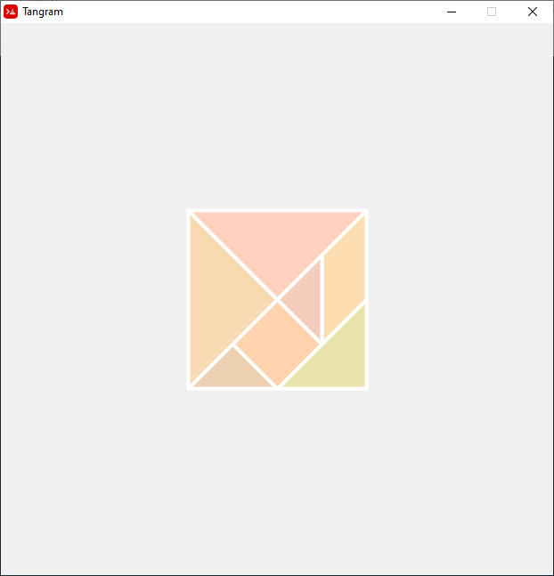

# Games

Hex-Pave
-

Hex-pave is a puzzle invented by Carl Hoff. The goal is to arrange all of the tiles flat in the hexagonal tray.

My implementation is a WIP. It need the following improvements:
  - Currently there's no collision detection and tiles can go on top of / beneath each other
  - The tiles are rendered in the order of their creation. This means that the tiles that are created earlier may stay behind the ones created later.
  - No solution detection. The player should check the solution for himself/herself. 
  
Island Alleys 
-

A logic puzzle invented by me. The objective is to connect horizontally and vertically adjacent dots by clicking between them so that the lines form a simple loop with no loose ends that goes through all the dots (so the line forms a Hamiltonian cycle on a grid).
The lines of the loop enclose an island. The island is exactly one square wide at all places, that’s why and I call the paths “alleys”. Where 2 or more alleys meet at a right angle, there is always a number indicating the total distance from that square to the shores in all directions – East, West, North and South.
[Detailed solving instructions](https://github.com/GalenIvanov/Games/blob/master/Island%20Alleys%20-%20solving%20instructions.pdf)

Looper
-

Looper is a puzzle game invented by me. The goal is to arrange the lines on the grid so that they form a simple loop that covers all the dots (Technically speaking the lines will form a Hamiltonian cycle). Drag the pieces with the left mouse button. Hover the pieces over the icons in the bottom area of the window to flip / rotate them. You can alternatively flip the pieces with the right mouse button and rotate them with the mouse wheel. [Video](https://www.youtube.com/watch?v=emjGl_HVc70&t=7s)

Tangram
-

An interactive tangram puzzle.

Izzi
-

[Izzi](https://www.thinkfun.com/products/izzi/) is a matching puzzle designed by Frank Nichols and made in 1992 by Binary Arts (now called ThinkFun): 
"This pattern matching puzzle consists of 64 square tiles, each printed with a black and white geometric pattern. Your goal is to assemble the tiles into an 8x8 square following the IZZI rule: In order to place two tiles adjacent to one another, their colored edges must match up precisely."
